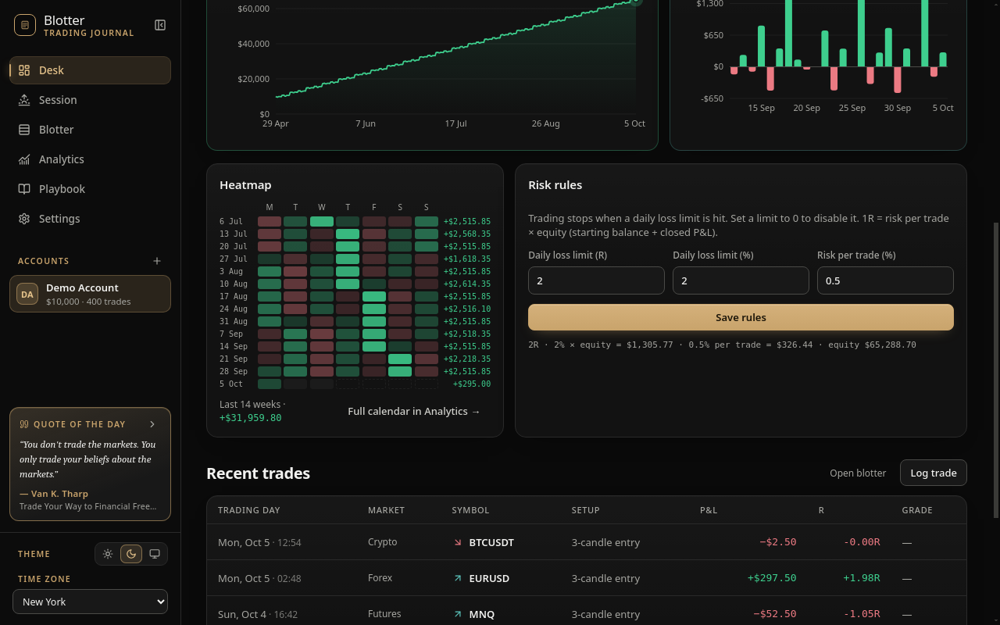
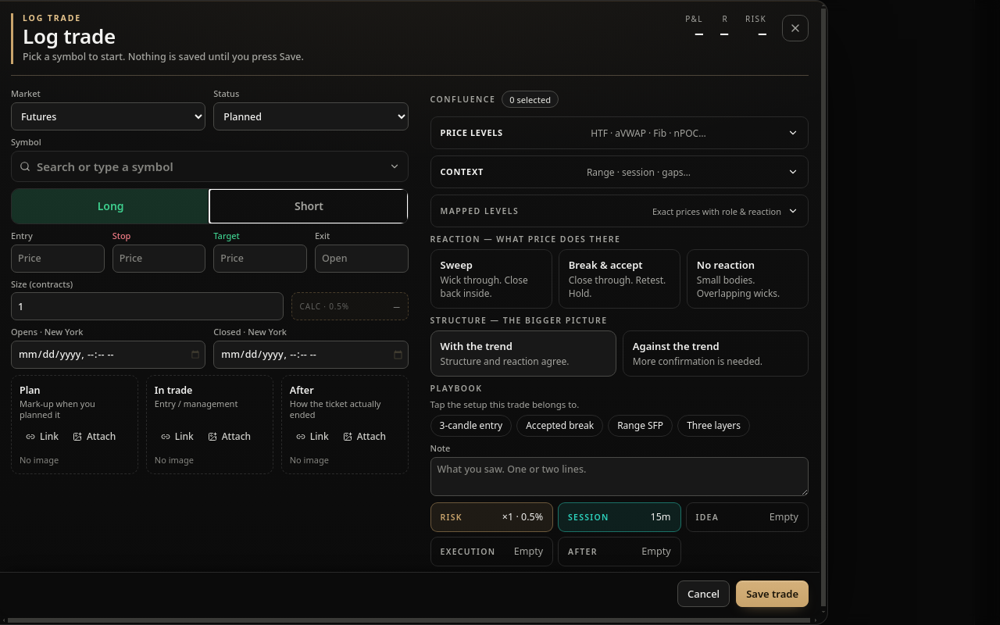
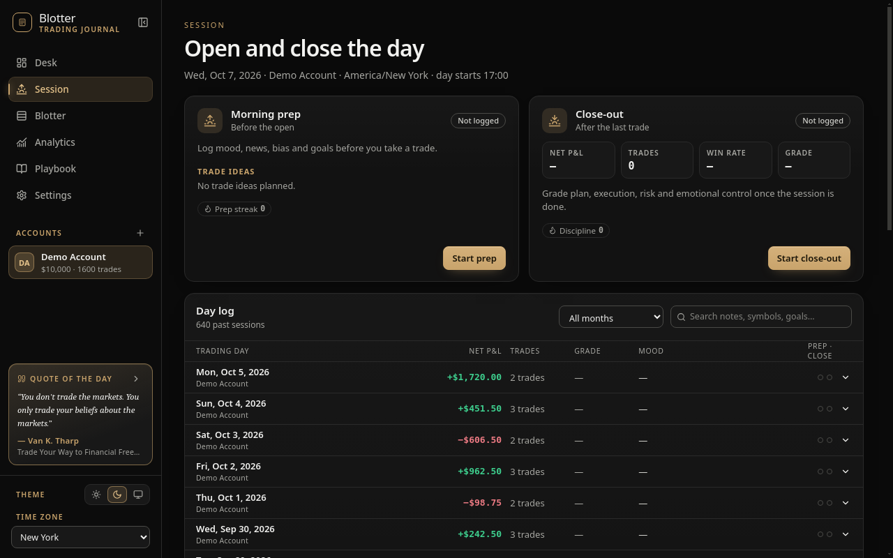
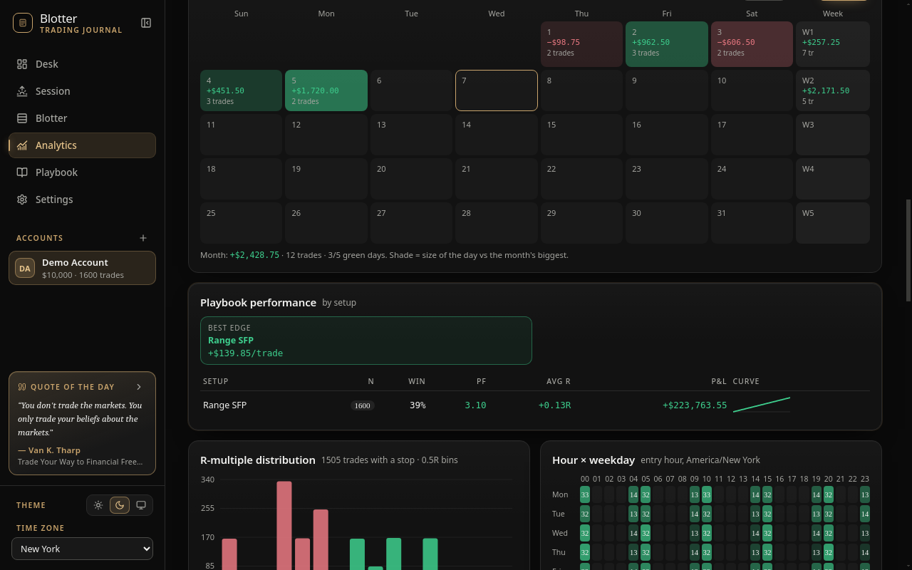

<p align="center">
  
</p>

<h1 align="center">Blotter</h1>

<p align="center">
  <b>A private, offline trading journal for Windows.</b><br>
  Log every ticket, review every session, and measure your edge — without an account, a subscription, or a cloud.
</p>

<p align="center">
  <a href="https://github.com/kishikaisei666/blotter-desktop/releases/latest"><b>⬇ Download the latest release</b></a>
  &nbsp;·&nbsp;
  <a href="#verify-your-download">Verify your download</a>
  &nbsp;·&nbsp;
  <a href="https://github.com/kishikaisei666/blotter-desktop/releases">Changelog</a>
</p>

---

## Contents

- [Screenshots](#screenshots)
- [Features](#features)
- [Privacy & offline by design](#privacy--offline-by-design)
- [Install](#install)
- [Why Windows warns you (and what to do)](#why-windows-warns-you-and-what-to-do)
- [Verify your download](#verify-your-download)
- [Updating](#updating)
- [Your data & backups](#your-data--backups)
- [FAQ](#faq)
- [Disclaimer](#disclaimer)
- [License](#license)
- [Changelog](#changelog)

---

## Screenshots

| | |
|---|---|
|  |  |
| **Desk** — net P&L, win rate, profit factor, expectancy, drawdown, equity curve, daily P&L and a 14-week heatmap. | **Log trade** — one drawer for the whole ticket: entry, stop, target, size calculator, chart screenshots, confluence and playbook. |
|  |  |
| **Session** — morning prep before the open, close-out after the last trade, and a searchable day log. | **Analytics** — P&L calendar, performance by setup, R-multiple distribution, hour × weekday heatmap and more. |

*Screenshots use the built-in demo account.*

---

## Features

**Journal**
- **Log trade drawer** — searchable symbol box with your recent symbols, Long/Short, entry / stop / target / exit, open and close time in your time zone.
- **147 built-in instruments** across futures, forex, crypto, stocks, options and CFDs with correct contract multipliers and tick sizes; edit or add your own.
- **Position-size calculator** from your risk per trade (% of current equity) and stop distance.
- **Fees, swap and FX** — per-market defaults, per-symbol overrides, and conversion to your account currency.
- **Chart screenshots** — Plan / In trade / After, attached from a file or a link.
- **Confluence & playbook** — price levels, context, mapped levels, setups, notes.
- **Risk, Session, Idea, Execution and After tiles** — emotions, mistakes, plan adherence, MAE / MFE.
- **Draft autosave** — an unsaved ticket is restored when you reopen Log trade.

**Daily routine**
- **Morning prep** — mood, news, bias, goals and trade ideas before the open.
- **Close-out** — grade your plan, execution, risk and emotional control at the end of the day.
- **Day log** — every trading day with P&L, trades, grade and mood; searchable by notes and symbols.
- **Trading-day start** — group trades by a custom day boundary (e.g. 17:00 New York for futures/FX).

**Review**
- **Desk** — KPIs, equity curve, daily P&L, heatmap, recent trades and a "today" strip with your loss limits.
- **Analytics** — equity and drawdown, win rate, consistency, streaks, P&L calendar, playbook performance, R-multiple distribution, hour × weekday, emotions vs results, mistakes, MAE / MFE.
- **Blotter** — full trade table with filters, search and inline editing.
- **Risk rules** — daily loss limit in R and %, risk per trade; warnings before you break them.

**Data**
- **Multiple accounts** with their own starting balance and currency.
- **Full backup** to a single `.zip` (trades, screenshots, settings) and restore.
- **CSV** export/import for Excel and Google Sheets, with a documented column map and an empty template.
- **Automatic backups** on every close (last 10 kept).
- Dark and light themes, collapsible sidebar, keyboard-friendly.

---

## Privacy & offline by design

Blotter is a local app. **There is no account, no sign-in, no analytics, no telemetry and no ads.** Your trades, notes and screenshots never leave your computer unless you export them yourself.

Blotter makes **exactly two kinds of network requests**, both read-only and both without any of your data:

| Purpose | Host | When | What is sent |
|---|---|---|---|
| Update check | `github.com` / `objects.githubusercontent.com` (this repository's Releases) | On start (if enabled) and when you click *Check for updates* (*Settings → About and updates*) | A standard HTTPS request for `latest.yml`; if a newer version exists, the installer version downloads the new Setup file |
| FX rates (ECB reference rates) | `api.frankfurter.dev` | Once per day on start (*Settings → FX rates → Auto-update daily*, can be turned off) and when you click *Update rates* | The list of currency codes, e.g. `?from=USD&to=EUR,GBP,JPY…` |

That's it. Offline? Blotter works fully offline and keeps the last saved FX rates.

> If you paste an `https://` link to a chart image (for example a TradingView snapshot), the image is loaded from that site when you view the trade — just like opening the link in a browser.

---

## Install

Download from **[Releases → Latest](https://github.com/kishikaisei666/blotter-desktop/releases/latest)**. Windows 10 / 11, 64-bit.

| | **Installer** — `Blotter-Setup-<version>.exe` | **Portable** — `Blotter-<version>-portable.exe` |
|---|---|---|
| Admin rights | Not needed (installs for the current user) | Not needed |
| Start menu / desktop shortcut | Yes | No — run the `.exe` directly |
| Automatic updates | **Yes** | No — the app tells you when a new version is out |
| Data location | `%APPDATA%\Blotter\data` | `data\` next to the `.exe` |
| Best for | Most users | USB stick, trying it out, no-install machines |

**Recommended:** the installer. You can move your data between the two at any time with *Settings → Data & backup → Export all (.zip) / Import from .zip*.

---

## Why Windows warns you (and what to do)

Blotter is built by one independent developer and is **not code-signed** yet. A code-signing certificate costs hundreds of dollars a year, and new signed apps still have to build "reputation" before warnings go away. Windows can't tell who published an unsigned app, so it asks you to decide. That is what the warnings mean — not that something bad was found.

**Before you click through, [verify your download](#verify-your-download).** If the hash matches, the file is exactly the one published here.

### Microsoft Defender SmartScreen — "Windows protected your PC"
1. Click **More info**.
2. Check that the file name is `Blotter-Setup-<version>.exe` (Publisher: *Unknown publisher*).
3. Click **Run anyway**.

### Smart App Control (Windows 11)
If Smart App Control is **On**, Windows blocks unsigned apps outright and there is **no "Run anyway" button** and no per-app exception. Your options:
- Keep Smart App Control on and don't use Blotter for now — that's a perfectly reasonable choice; or
- Temporarily turn it off: *Windows Security → App & browser control → Smart App Control settings → Off*, install and run Blotter, then decide whether to turn it back on.

> On Windows 11 builds before the April 2026 update (KB5083769), Smart App Control **cannot be turned back on without resetting Windows** once turned off. Check that you are up to date before changing it, and only do it if you trust the file.

### Antivirus false positives
A few antivirus engines flag unsigned installers built with common tools (Electron + NSIS) using generic names such as *Wacatac*, *Malgent* or "ML/heuristic". You can look up any release on VirusTotal by its SHA-256 (see [Verify your download](#verify-your-download)) to see the full results yourself. If your antivirus quarantines Blotter, verify the hash, restore the file and add an exception — and please [open an issue](https://github.com/kishikaisei666/blotter-desktop/issues) with the engine name so it can be reported as a false positive.

**Never** download Blotter from anywhere other than this repository's Releases page. There are no mirrors, no paid versions and no "cracked" builds.

---

## Verify your download

Every release lists the SHA-256 hash of each file. If your hash matches, the file is byte-for-byte what was published here.

### Hashes

Each release page lists the hashes for that version in this format:

| File | SHA-256 |
|---|---|
| `Blotter-Setup-X.Y.Z.exe` | `<SHA256_SETUP>` |
| `Blotter-X.Y.Z-portable.exe` | `<SHA256_PORTABLE>` |

**Current release example — [v0.3.0](https://github.com/kishikaisei666/blotter-desktop/releases/tag/v0.3.0):**

| File | SHA-256 |
|---|---|
| `Blotter-Setup-0.3.0.exe` | `7b7e779fbe5699f56aefb05cb0e33c25a53b6fd9246a300eb2b298930fa8d829` |
| `Blotter-0.3.0-portable.exe` | `fd0b8508cc530068ed13cd3509a7a6c9f617687b1c28075c11a4b9f7d0192252` |

For newer versions, always use the hashes on that version's release page.

### Check on Windows (PowerShell)

```powershell
cd $HOME\Downloads
Get-FileHash .\Blotter-Setup-X.Y.Z.exe -Algorithm SHA256
```

Compare the `Hash` value with the table above (case doesn't matter). One-liner that answers True/False:

```powershell
(Get-FileHash .\Blotter-Setup-X.Y.Z.exe).Hash -eq '<SHA256_SETUP>'
```

Command Prompt alternative: `certutil -hashfile Blotter-Setup-X.Y.Z.exe SHA256`

### VirusTotal

- Installer: `https://www.virustotal.com/gui/file/<SHA256_SETUP>`
- Portable: `https://www.virustotal.com/gui/file/<SHA256_PORTABLE>`

Replace `<SHA256_…>` with the hash from the release page to open that file's VirusTotal report, or upload the file yourself at [virustotal.com](https://www.virustotal.com).

---

## Updating

- **Installer version:** Blotter checks GitHub Releases on start. When an update has downloaded, *Settings → About and updates* shows **Install update** — click it and the Setup runs (SmartScreen may ask again: *More info → Run anyway*). Updates are downloaded over HTTPS and verified against the SHA-512 in the release's `latest.yml` before they run. Older versions are never installed over newer ones. You can turn automatic checks off in the same section.
- **Portable version:** the app shows a notice when a new version is available. Download the new portable `.exe`, close Blotter and replace the old file — keep the `data\` folder next to it.
- What changed: see [Releases](https://github.com/kishikaisei666/blotter-desktop/releases).

---

## Your data & backups

| | Installer | Portable |
|---|---|---|
| Database & screenshots | `%APPDATA%\Blotter\data` | `data\` next to the `.exe` |
| Automatic backups | `%APPDATA%\Blotter\backups` | `backups\` next to the `.exe` |

- Data is a local SQLite database plus a `screenshots` folder. Nothing is synced anywhere.
- **Automatic backup** on every close; the newest 10 are kept. *Settings → Data & backup → Open backups folder*.
- **Manual backup:** *Settings → Data & backup → Export all (.zip)* — one file with all accounts, trades, screenshots and settings. Restore it with *Import from .zip* on any PC (merge or replace).
- **Choose another folder…:** you can move your data to another folder (for example one that your own cloud drive syncs). Close Blotter on other PCs before opening the same folder.
- **Uninstalling** removes the app but **keeps your data**. Delete `%APPDATA%\Blotter` yourself if you want it gone.

---

## FAQ

**Is Blotter free?**
Yes. No trial, no subscription, no in-app purchases.

**Do I need an account or internet?**
No. Internet is only used for update checks and daily FX rates (see [Privacy](#privacy--offline-by-design)).

**Does it connect to my broker?**
No. Blotter never asks for broker logins, API keys or wallets — and never will. If anyone offers a "Blotter" that does, it's not this app.

**Can I import my trades?**
Yes — via CSV (*Settings → Import from Sheets*: upload a file or paste a range). The column map is documented in the app, and there's an empty template to download.

**Is it open source?**
Not at the moment. The app is free to use; the source is kept private. You can verify every release by hash and VirusTotal, and you can check the network table above with any firewall (e.g. Windows Defender Firewall, GlassWire, Wireshark).

**Why is the download ~85 MB?**
Blotter is built on Electron, which bundles its own Chromium engine so the app looks and behaves the same on every PC.

**Mac or Linux?**
Windows only for now.

**Which markets are supported?**
Futures, forex, crypto, stocks, options and CFDs. Instruments not in the list can be added with your own multiplier, tick size and currency.

**I found a bug / have an idea.**
Please [open an issue](https://github.com/kishikaisei666/blotter-desktop/issues). Never post your database or screenshots of personal account data publicly.

**How do I report a security issue?**
Please don't open a public issue — contact [@ki_shikaisei on X](https://x.com/ki_shikaisei) by DM first.

---

## Disclaimer

Blotter is a journaling and record-keeping tool. **It is not financial, investment or trading advice**, and it does not recommend any trade, instrument or strategy. Calculations (P&L, R-multiple, position size, fees, FX conversion, statistics) are provided for convenience and may contain errors — always verify them against your broker statements. Trading involves substantial risk of loss. You are solely responsible for your trading decisions.

The quotes shown in the app are attributed to their authors and sources for educational purposes.

---

## License

Blotter is **freeware**: free to download and use for personal purposes. The software is proprietary — © 2026 kishikaisei. All rights reserved. Redistribution, resale, modification or reverse-engineering of the binaries is not permitted.

Blotter includes open-source components (Electron, Chromium, React, better-sqlite3, JSZip and others) under their own licenses; see `LICENSE.electron.txt` and `LICENSES.chromium.html` in the install folder.

THE SOFTWARE IS PROVIDED "AS IS", WITHOUT WARRANTY OF ANY KIND.

---

## Changelog

Release notes for every version: **[github.com/kishikaisei666/blotter-desktop/releases](https://github.com/kishikaisei666/blotter-desktop/releases)**.
